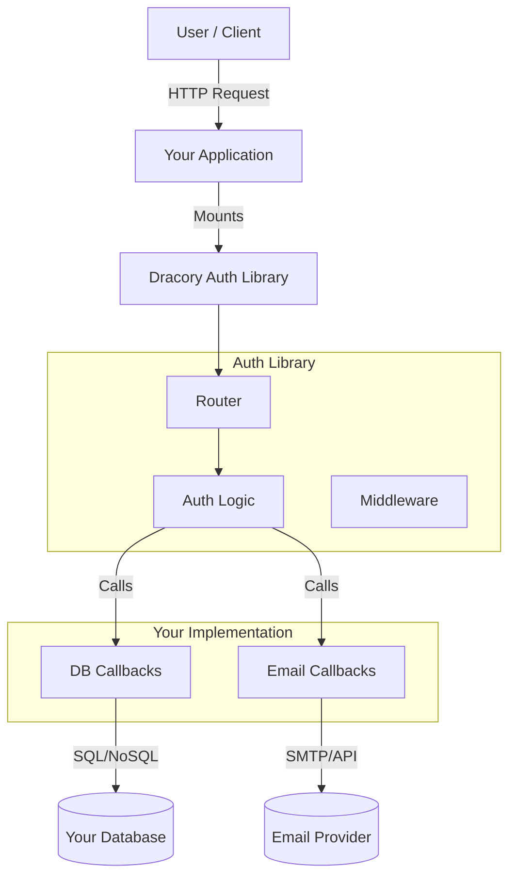

# Architecture

Dracory Auth is designed as a **Library**, not a Service. It is embedded directly into your Go application, running in the same process.

## High-Level Design

The library is split into three main layers:

1.  **Transport Layer**: HTTP Handlers and Router (Gin/Echo/Stdlib compatible via `net/http`).
2.  **Logic Layer**: Authentication flows (Passwordless, Username/Password), Session management, Security (CSRF, Rate Limiting).
3.  **Data Layer (Callbacks)**: Interfaces you implement to connect to your database and external services.

## Dependency Injection

The library uses a form of dependency injection via the Configuration structs (`ConfigPasswordless`, `ConfigUsernameAndPassword`). You inject the behavior (functions) rather than the data.

## Security Architecture

*   **Tokens**: Randomly generated, stored via callbacks.
*   **Cookies**: `HttpOnly`, `Secure`, `SameSite`.
*   **Rate Limiting**: In-memory token bucket algorithm, keyed by IP and Endpoint.
*   **CSRF**: Double Submit Cookie pattern (via `dracory/csrf`).
