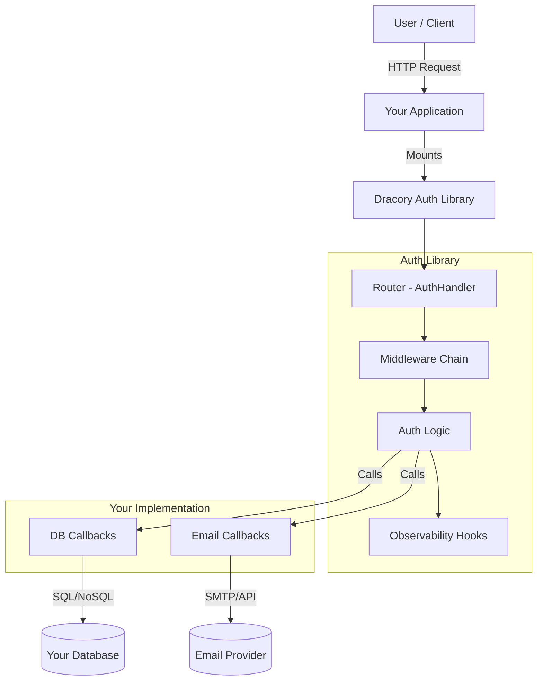

# Architecture

Dracory Auth is designed as a **Library**, not a Service. It is embedded directly into your Go application, running in the same process.

## High-Level Design

The library is split into four main layers:

1.  **Transport Layer**: HTTP Handlers and Router (`net/http` compatible, works with any Go router).
2.  **Logic Layer**: Authentication flows (Passwordless, Username/Password, AuthKnight), Session management, Impersonation, Security (CSRF, Rate Limiting).
3.  **Data Layer (Callbacks)**: Interfaces you implement to connect to your database and external services.
4.  **Observability Layer**: Optional hooks for metrics and tracing via `ObservabilityHooks` interface.

```mermaid
graph TD
    User[User / Client] -->|HTTP Request| App[Your Application]
    App -->|Mounts| AuthLib[Dracory Auth Library]
    
    subgraph "Auth Library"
        Router[Router - AuthHandler]
        Mid[Middleware Chain]
        Logic[Auth Logic]
        Obs[Observability Hooks]
    end
    
    AuthLib --> Router
    Router --> Mid
    Mid --> Logic
    Logic --> Obs
    
    subgraph "Your Implementation"
        DB_Adapter[DB Callbacks]
        Email_Adapter[Email Callbacks]
    end
    
    Logic -->|Calls| DB_Adapter
    Logic -->|Calls| Email_Adapter
    
    DB_Adapter -->|SQL/NoSQL| DB[(Your Database)]
    Email_Adapter -->|SMTP/API| Email[(Email Provider)]
```

## Three Authentication Flows

### 1. Passwordless (`NewPasswordlessAuth`)
Email-based verification codes. Config: `types.ConfigPasswordless`. Interface: `AuthPasswordlessInterface`.

### 2. Username/Password (`NewUsernameAndPasswordAuth`)
Traditional auth with password reset. Config: `types.ConfigUsernameAndPassword`. Interface: `AuthPasswordInterface`.

### 3. AuthKnight (`NewAuthKnightAuth`)
OAuth-style hosted login via AuthKnight.com. Config: `types.ConfigAuthKnight`. Interface: `AuthAuthKnightInterface`.

## Core Struct: `authImplementation`

Defined in `auth_implementation.go`, this struct holds all configuration, callbacks, and state:
- Router (`*http.ServeMux`)
- Configuration fields (endpoint, URLs, flags)
- Callback functions (user lookup, token storage, email sending)
- Rate limiter instance
- CSRF settings
- Impersonation settings
- AuthKnight settings
- Observability hooks
- Logger (`*slog.Logger`)

## Router Design

`router.go` uses `AuthHandler` which routes by URI suffix matching to page handlers and API handlers. The `uriHasPathSuffix` function ensures path-boundary-safe matching (e.g., `/mylogin` does not match `login`).

Routes are built dynamically in `buildAPIRoutes()` based on enabled features (registration, impersonation, AuthKnight). Each API route is wrapped with rate limiting middleware, and optionally CSRF middleware.

## Dependency Injection

The library uses dependency injection via Configuration structs. You inject behavior (functions) rather than data. All three config structs embed shared sub-structs:
- `ConfigShared` — common fields (endpoint, callbacks, cookies, logger, observability)
- `ConfigRateLimiting` — rate limit settings
- `ConfigCSRF` — CSRF protection settings
- `ConfigImpersonation` — impersonation settings

## Security Architecture

*   **Tokens**: Randomly generated, stored via callbacks.
*   **Cookies**: Configurable via `CookieConfig` with functional options. Defaults: `HttpOnly`, `Secure`, `SameSite=Lax`.
*   **Rate Limiting**: In-memory token bucket algorithm, keyed by IP and Endpoint. Thread-safe with mutex synchronization.
*   **CSRF**: Double Submit Cookie pattern (via `dracory/csrf`). Binds to IP, User-Agent, and Path.
*   **Password Security**: Configurable strength validation (`PasswordStrengthConfig`), constant-time password comparison.
*   **Impersonation**: Secure token swap with temporary key storage (`imp:` prefix). Original admin token preserved for restoration.

## Observability

The `ObservabilityHooks` interface provides optional metrics/tracing integration:
- `RecordLoginAttempt(method, success, err)`
- `RecordRegistrationAttempt(success, err)`
- `RecordRateLimitHit(endpoint, ip)`
- `RecordSessionCreated(userID)`
- `RecordPasswordReset(success, err)`
- `RecordImpersonationStart(adminUserID, targetUserID)`
- `RecordImpersonationStop(adminUserID, targetUserID)`

Default: `NoopObservabilityHooks` (no-op implementation).

## Interfaces

| Interface | Extends | Purpose |
| :--- | :--- | :--- |
| `AuthSharedInterface` | — | Base interface: routing, middleware, URL helpers, accessors |
| `AuthPasswordInterface` | `AuthSharedInterface` | Adds password reset/restore URL helpers |
| `AuthPasswordlessInterface` | `AuthSharedInterface` | Adds login code verify URL helpers |
| `AuthAuthKnightInterface` | `AuthSharedInterface` | Adds AuthKnight login, redirect, callback URL helpers |

## Changelog
- **v2.0.0** (2026-07-16): Added AuthKnight flow, impersonation, observability layer, cookie configuration, updated interfaces, structured logging
- **v1.0.0** (2025-12-04): Initial creation
