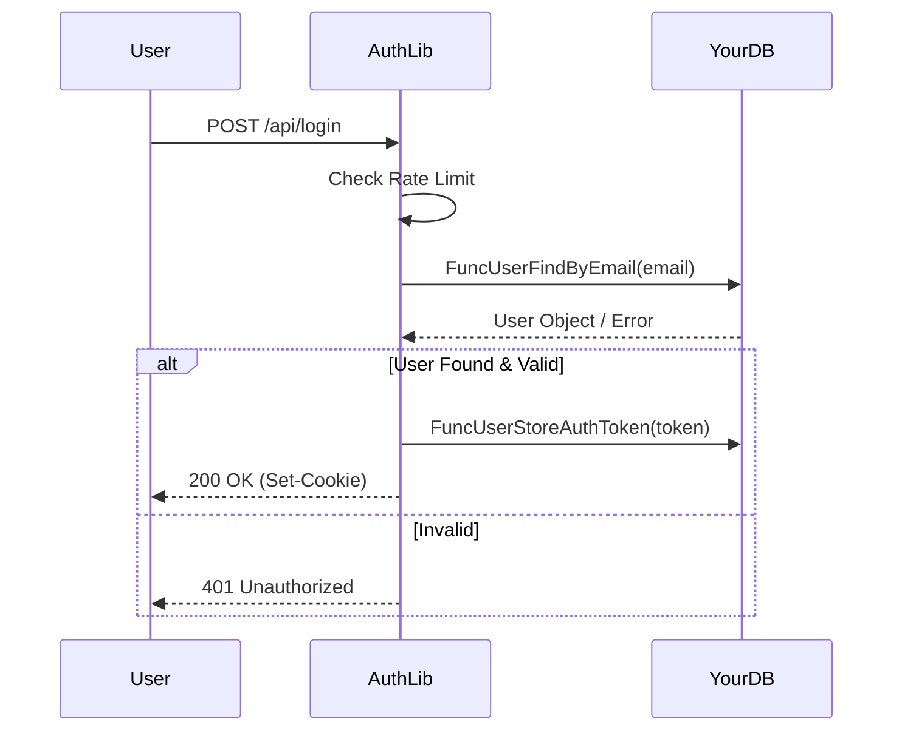

# Data Flow

Understanding how data moves through the system helps in debugging and customization.

## 1. Authentication Request Flow

When a user attempts to log in:

1.  **Client** sends `POST /api/login`.
2.  **Rate Limiter** checks IP/Endpoint. If limit exceeded -> 429 Too Many Requests.
3.  **Router** routes to `internal/api/api_login`.
4.  **Handler** parses JSON body.
5.  **Logic** calls `FuncUserFindByEmail` (your callback).
    *   If user not found -> Return generic error (prevent enumeration).
6.  **Logic** validates credentials (password check or code generation).
7.  **Logic** calls `FuncUserStoreAuthToken`.
8.  **Handler** sets `HttpOnly` cookie.
9.  **Handler** returns JSON success.

## 2. Protected Route Flow

When an authenticated user requests a protected resource:

1.  **Client** sends `GET /dashboard` (with Cookie).
2.  **Middleware** (`WebAuthOrRedirectMiddleware`) intercepts request.
3.  **Middleware** extracts token from Cookie.
4.  **Middleware** calls `FuncUserFindByAuthToken`.
    *   If valid: Adds User ID to Context. calls `next.ServeHTTP`.
    *   If invalid: Redirects to `/login`.
