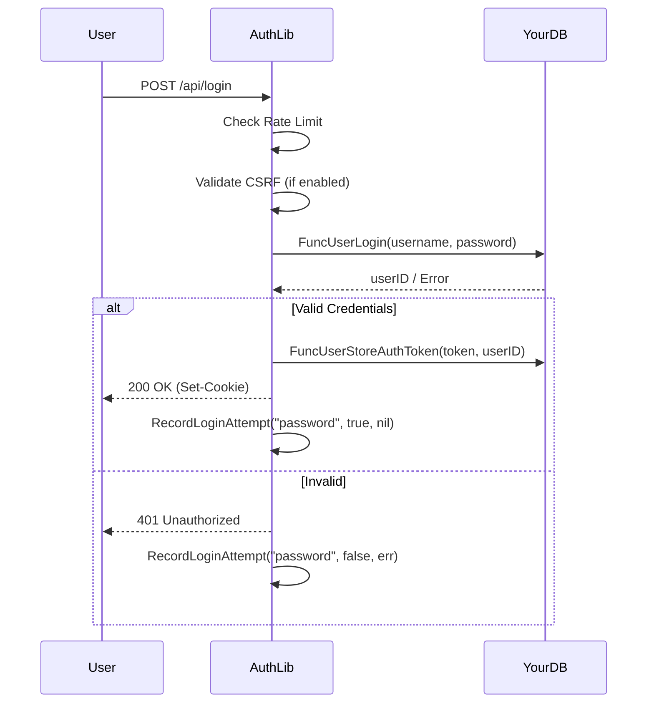
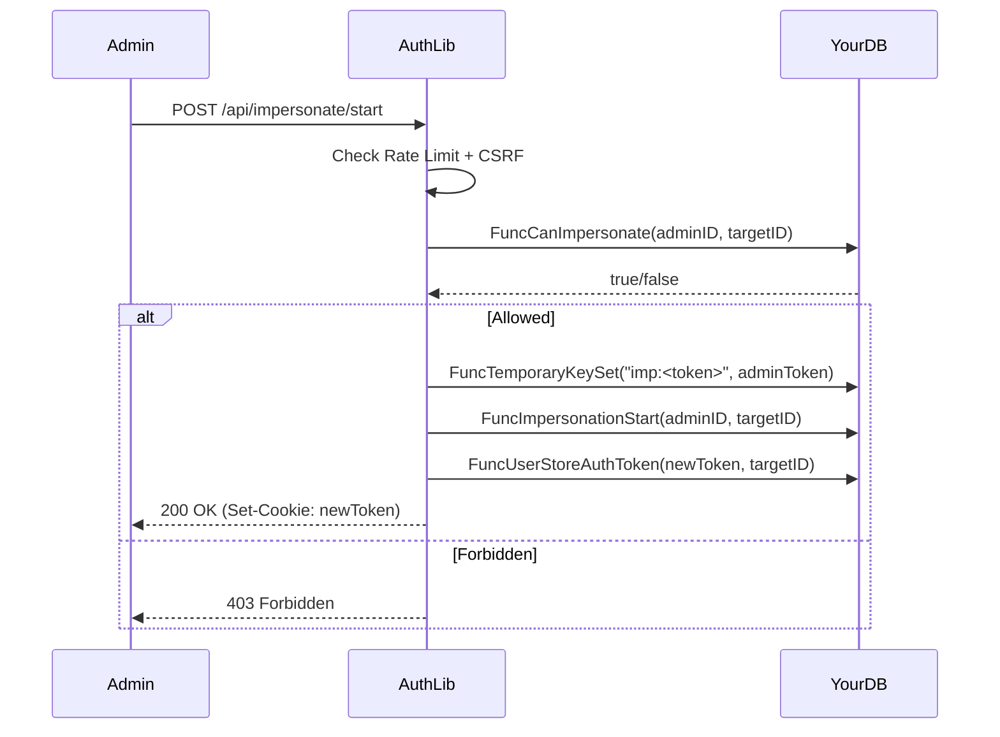
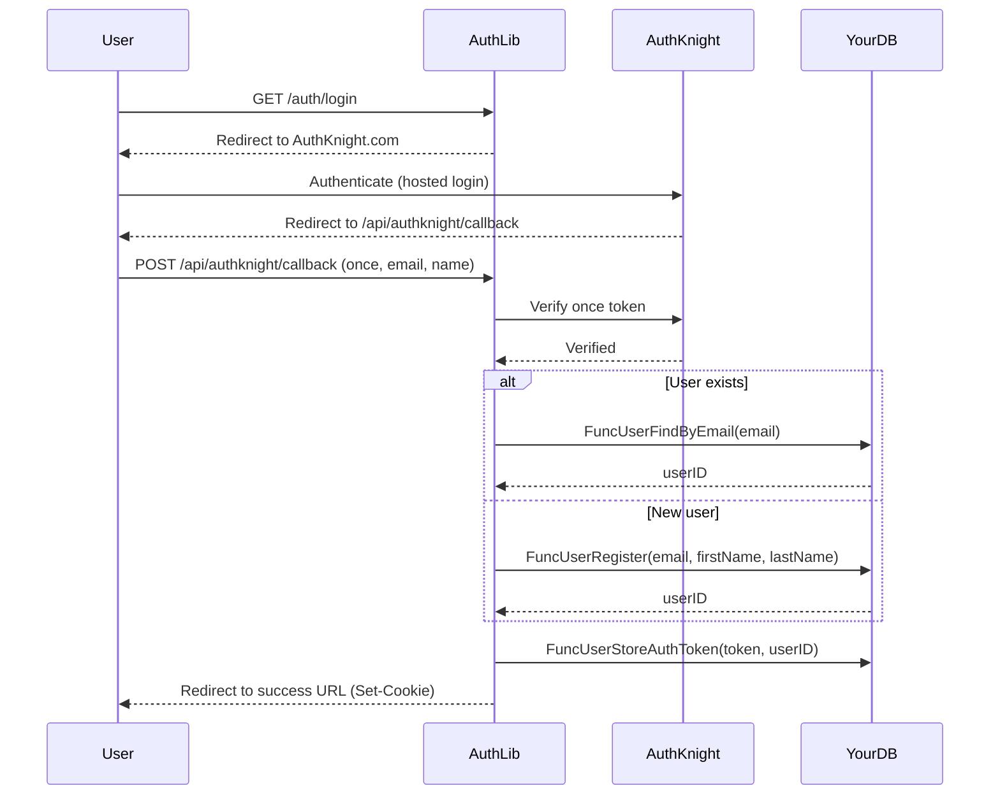

# Data Flow

Understanding how data moves through the system helps in debugging and customization.

## 1. Authentication Request Flow (Username/Password)

When a user attempts to log in:

1.  **Client** sends `POST /api/login`.
2.  **Rate Limiter** checks IP/Endpoint. If limit exceeded -> 429 Too Many Requests.
3.  **CSRF Middleware** validates token (if CSRF enabled).
4.  **Router** (`AuthHandler`) routes to `internal/api/api_login`.
5.  **Handler** parses JSON body.
6.  **Logic** calls `FuncUserLogin` (your callback).
    *   If invalid -> Return generic error (prevent enumeration).
7.  **Logic** calls `FuncUserStoreAuthToken`.
8.  **Handler** sets auth cookie.
9.  **Handler** returns JSON success.
10. **Observability** hook `RecordLoginAttempt` called.

```mermaid
sequenceDiagram
    participant User
    participant AuthLib
    participant YourDB
    
    User->>AuthLib: POST /api/login
    AuthLib->>AuthLib: Check Rate Limit
    AuthLib->>AuthLib: Validate CSRF (if enabled)
    AuthLib->>YourDB: FuncUserLogin(username, password)
    YourDB-->>AuthLib: userID / Error
    
    alt Valid Credentials
        AuthLib->>YourDB: FuncUserStoreAuthToken(token, userID)
        AuthLib-->>User: 200 OK (Set-Cookie)
        AuthLib->>AuthLib: RecordLoginAttempt("password", true, nil)
    else Invalid
        AuthLib-->>User: 401 Unauthorized
        AuthLib->>AuthLib: RecordLoginAttempt("password", false, err)
    end
```

## 2. Passwordless Login Flow

1.  **Client** sends `POST /api/login` with email.
2.  **Logic** calls `FuncUserFindByEmail`.
3.  **Logic** generates verification code, stores via `FuncTemporaryKeySet`.
4.  **Logic** sends email via `FuncEmailSend` with login code.
5.  **Client** sends `POST /api/login-code-verify` with email + code.
6.  **Logic** verifies code via `FuncTemporaryKeyGet`.
7.  **Logic** calls `FuncUserStoreAuthToken`, sets cookie.

## 3. Protected Route Flow

When an authenticated user requests a protected resource:

1.  **Client** sends `GET /dashboard` (with Cookie).
2.  **Middleware** (`WebAuthOrRedirectMiddleware`) intercepts request.
3.  **Middleware** extracts token from Cookie (or Bearer header for API).
4.  **Middleware** calls `FuncUserFindByAuthToken`.
    *   If valid: Adds User ID to Context. calls `next.ServeHTTP`.
    *   If invalid: Redirects to `/login` (web) or returns 401 JSON (API).

## 4. Impersonation Flow

When an admin starts impersonating another user:

1.  **Admin** sends `POST /api/impersonate/start` with `target_user_id`.
2.  **CSRF + Rate Limit** middleware process the request.
3.  **Logic** calls `FuncCanImpersonate(adminUserID, targetUserID)`.
    *   If not allowed -> 403 Forbidden.
4.  **Logic** stores original admin token via `FuncTemporaryKeySet` (key: `imp:<token>`).
5.  **Logic** calls `FuncImpersonationStart` callback.
6.  **Logic** calls `FuncUserStoreAuthToken` with new token for target user.
7.  **Handler** sets cookie with new impersonation token.
8.  **Observability** hook `RecordImpersonationStart` called.

To stop impersonation:

1.  **Admin** sends `POST /api/impersonate/stop`.
2.  **Logic** retrieves original admin token from `FuncTemporaryKeyGet` (key: `imp:<current_token>`).
3.  **Logic** calls `FuncImpersonationStop` callback.
4.  **Logic** restores original admin token cookie.
5.  **Observability** hook `RecordImpersonationStop` called.

```mermaid
sequenceDiagram
    participant Admin
    participant AuthLib
    participant YourDB
    
    Admin->>AuthLib: POST /api/impersonate/start
    AuthLib->>AuthLib: Check Rate Limit + CSRF
    AuthLib->>YourDB: FuncCanImpersonate(adminID, targetID)
    YourDB-->>AuthLib: true/false
    
    alt Allowed
        AuthLib->>YourDB: FuncTemporaryKeySet("imp:<token>", adminToken)
        AuthLib->>YourDB: FuncImpersonationStart(adminID, targetID)
        AuthLib->>YourDB: FuncUserStoreAuthToken(newToken, targetID)
        AuthLib-->>Admin: 200 OK (Set-Cookie: newToken)
    else Forbidden
        AuthLib-->>Admin: 403 Forbidden
    end
```

## 5. AuthKnight OAuth Flow

When a user authenticates via AuthKnight:

1.  **Client** visits login page, which redirects to AuthKnight.com.
2.  **AuthKnight** authenticates the user (hosted login page).
3.  **AuthKnight** redirects back to `POST /api/authknight/callback` with `once` token + user data.
4.  **Logic** verifies the `once` token with AuthKnight API.
5.  **Logic** calls `FuncUserFindByEmail` to check if user exists.
    *   If not found: calls `FuncUserRegister` to create user (email pre-verified).
6.  **Logic** calls `FuncUserStoreAuthToken`, sets cookie.
7.  **Logic** redirects to `FuncRedirectURL` (or `UrlRedirectOnSuccess` fallback).

```mermaid
sequenceDiagram
    participant User
    participant AuthLib
    participant AuthKnight
    participant YourDB
    
    User->>AuthLib: GET /auth/login
    AuthLib-->>User: Redirect to AuthKnight.com
    User->>AuthKnight: Authenticate (hosted login)
    AuthKnight-->>User: Redirect to /api/authknight/callback
    User->>AuthLib: POST /api/authknight/callback (once, email, name)
    AuthLib->>AuthKnight: Verify once token
    AuthKnight-->>AuthLib: Verified
    
    alt User exists
        AuthLib->>YourDB: FuncUserFindByEmail(email)
        YourDB-->>AuthLib: userID
    else New user
        AuthLib->>YourDB: FuncUserRegister(email, firstName, lastName)
        YourDB-->>AuthLib: userID
    end
    
    AuthLib->>YourDB: FuncUserStoreAuthToken(token, userID)
    AuthLib-->>User: Redirect to success URL (Set-Cookie)
```

## Changelog
- **v2.0.0** (2026-07-16): Added impersonation flow, AuthKnight OAuth flow, passwordless flow, CSRF/rate-limit in flow, observability hooks
- **v1.0.0** (2025-12-04): Initial creation
