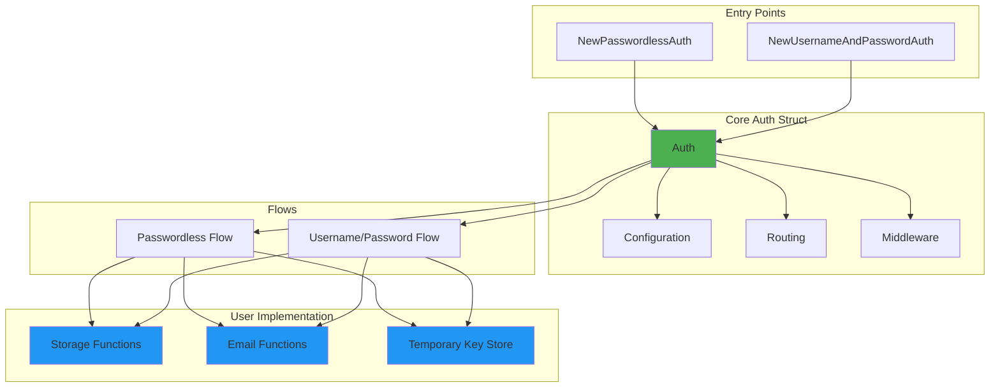
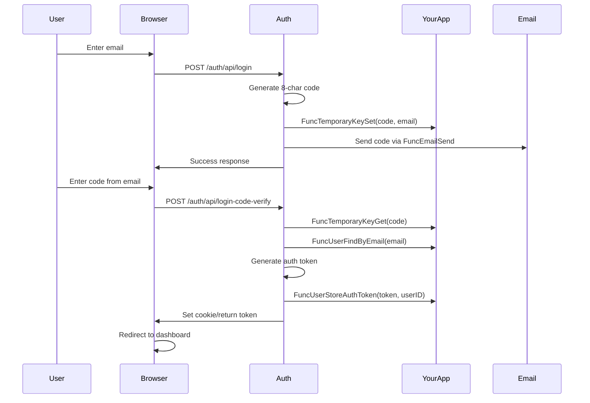
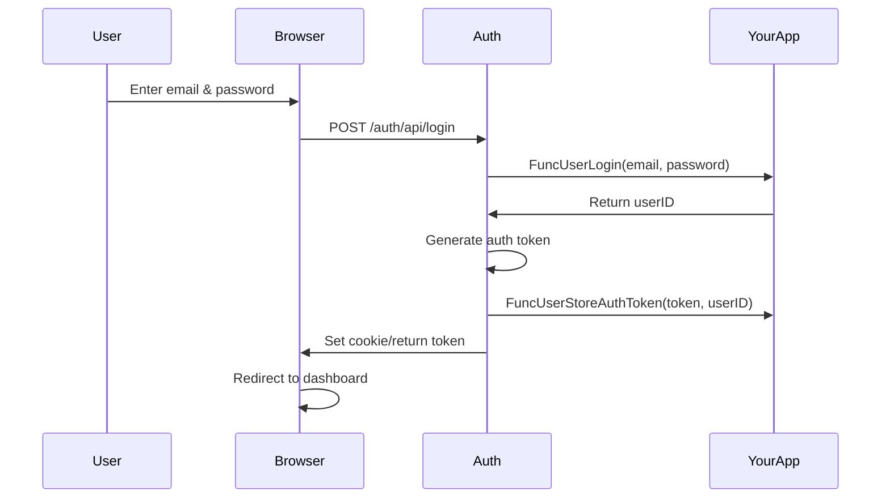

# Package Overview: dracory/auth

**Last Updated:** 2025-11-27

---

## What is dracory/auth?

`dracory/auth` is a **batteries-included authentication library** for Go that provides ready-to-use authentication flows with minimal setup. It's designed to be **implementation-agnostic**, meaning you bring your own database, session store, and email service—the library handles all the authentication logic, UI pages, and API endpoints.

## Core Philosophy

1. **Two Authentication Strategies**
   - **Username/Password Flow** - Traditional authentication with password storage
   - **Passwordless Flow** - Email-based verification codes (more secure, no password storage)

2. **Complete Solution**
   - Pre-built HTML pages for login, registration, password reset
   - JSON API endpoints for SPA/mobile apps
   - Authentication middleware for protecting routes
   - Customizable email templates

3. **Flexible Storage**
   - You implement the storage layer via callback functions
   - Works with any database (SQL, NoSQL, in-memory)
   - You control session/token management

---

## 🏗️ Architecture Overview



---

## 🔑 Key Components

### 1. **Auth Struct** ([auth.go](file:///d:/PROJECTs/_modules_dracory/auth/auth.go))

The central struct that holds all configuration and provides methods for authentication operations.

**Key Fields:**
- `endpoint` - Base URL path for auth routes (e.g., `/auth`)
- `enableRegistration` - Toggle registration feature
- `urlRedirectOnSuccess` - Where to redirect after successful auth
- `useCookies` / `useLocalStorage` - Token storage strategy
- `passwordless` - Flag to determine which flow is active
- `logger` - Optional `*slog.Logger` for structured logging
- Function callbacks for user operations (login, register, logout, etc.)

**Key Methods:**
- `Router()` - Returns HTTP router with all auth endpoints
- `WebAuthOrRedirectMiddleware()` - Protects web routes
- `ApiAuthOrErrorMiddleware()` - Protects API routes
- `GetCurrentUserID()` - Retrieves authenticated user from context
- `LinkLogin()`, `LinkRegister()`, etc. - URL helpers

### 2. **Configuration Structs**

**[ConfigPasswordless](file:///d:/PROJECTs/_modules_dracory/auth/config_passwordless.go):**
```go
type ConfigPasswordless struct {
    // Required
    Endpoint                string
    UrlRedirectOnSuccess    string
    FuncUserFindByAuthToken func(ctx context.Context, sessionID string, options UserAuthOptions) (userID string, err error)
    FuncUserFindByEmail     func(ctx context.Context, email string, options UserAuthOptions) (userID string, err error)
    FuncUserLogout          func(ctx context.Context, userID string, options UserAuthOptions) error
    FuncUserStoreAuthToken  func(ctx context.Context, sessionID string, userID string, options UserAuthOptions) error
    FuncEmailSend           func(ctx context.Context, email string, subject string, body string) error
    FuncTemporaryKeyGet     func(key string) (value string, err error)
    FuncTemporaryKeySet     func(key string, value string, expiresSeconds int) error
    UseCookies              bool // OR UseLocalStorage (one must be true)
    
    // Optional
    EnableRegistration           bool
    FuncUserRegister             func(ctx context.Context, email, firstName, lastName string, options UserAuthOptions) error
    FuncEmailTemplateLoginCode   func(ctx context.Context, email, loginLink string, options UserAuthOptions) string
    FuncEmailTemplateRegisterCode func(ctx context.Context, email, registerLink string, options UserAuthOptions) string
    FuncLayout                   func(content string) string
    Logger                       *slog.Logger // Optional structured logger (defaults to slog.Default when nil)
}
```

**[ConfigUsernameAndPassword](file:///d:/PROJECTs/_modules_dracory/auth/config_username_and_password.go):**
```go
type ConfigUsernameAndPassword struct {
    // Similar to passwordless, plus:
    FuncUserLogin          func(ctx context.Context, username, password string, options UserAuthOptions) (userID string, err error)
    FuncUserPasswordChange func(ctx context.Context, username, newPassword string, options UserAuthOptions) error
    FuncUserRegister       func(ctx context.Context, username, password, firstName, lastName string, options UserAuthOptions) error
    FuncUserFindByUsername func(ctx context.Context, username, firstName, lastName string, options UserAuthOptions) (userID string, err error)
    EnableVerification     bool // Email verification for registration
    Logger                 *slog.Logger // Optional structured logger
}
```

### 3. **Authentication Flows**

#### Passwordless Flow



**Key Files:**
- [api_login.go](file:///d:/PROJECTs/_modules_dracory/auth/api_login.go#L20-L56) - Sends verification code
- [api_login_code_verify.go](file:///d:/PROJECTs/_modules_dracory/auth/api_login_code_verify.go) - Verifies code and authenticates
- [page_login.go](file:///d:/PROJECTs/_modules_dracory/auth/page_login.go) - HTML login page
- [page_login_code_verify.go](file:///d:/PROJECTs/_modules_dracory/auth/page_login_code_verify.go) - Code entry page

#### Username/Password Flow



**Key Files:**
- [api_login.go](file:///d:/PROJECTs/_modules_dracory/auth/api_login.go#L58-L79) - Authenticates user
- [login_with_username_and_password.go](file:///d:/PROJECTs/_modules_dracory/auth/login_with_username_and_password.go) - Core login logic
- [api_password_restore.go](file:///d:/PROJECTs/_modules_dracory/auth/api_password_restore.go) - Password reset request
- [api_password_reset.go](file:///d:/PROJECTs/_modules_dracory/auth/api_password_reset.go) - Password reset completion

### 4. **Routing System** ([router.go](file:///d:/PROJECTs/_modules_dracory/auth/router.go))

The router handles all authentication endpoints:

**API Endpoints (JSON responses):**
- `POST /auth/api/login` - Initiate login
- `POST /auth/api/login-code-verify` - Verify passwordless code
- `POST /auth/api/logout` - Logout user
- `POST /auth/api/register` - Initiate registration
- `POST /auth/api/register-code-verify` - Verify registration code
- `POST /auth/api/restore-password` - Request password reset
- `POST /auth/api/reset-password` - Complete password reset

**Page Endpoints (HTML responses):**
- `GET /auth/login` - Login page
- `GET /auth/login-code-verify` - Code verification page
- `GET /auth/logout` - Logout page
- `GET /auth/register` - Registration page
- `GET /auth/register-code-verify` - Registration verification page
- `GET /auth/password-restore` - Password restore request page
- `GET /auth/password-reset?t=TOKEN` - Password reset page

All paths defined in [consts.go](file:///d:/PROJECTs/_modules_dracory/auth/consts.go).

### 5. **Middleware** 

**[WebAuthOrRedirectMiddleware](file:///d:/PROJECTs/_modules_dracory/auth/web_auth_or_redirect_middleware.go)** - For web pages:
- Checks for auth token (cookie or header)
- Validates token via `FuncUserFindByAuthToken`
- On success: adds `userID` to request context
- On failure: redirects to login page

**[ApiAuthOrErrorMiddleware](file:///d:/PROJECTs/_modules_dracory/auth/api_auth_or_error_middleware.go)** - For API endpoints:
- Same validation logic
- On failure: returns JSON error response

**[WebAppendUserIdIfExistsMiddleware](file:///d:/PROJECTs/_modules_dracory/auth/web_append_user_id_if_exists_middleware.go)** - Optional middleware:
- Adds userID to context if authenticated
- Does NOT redirect/error if not authenticated
- Useful for pages that work for both authenticated and guest users

**Usage:**
```go
// Protect web routes
mux.Handle("/dashboard", auth.WebAuthOrRedirectMiddleware(dashboardHandler))

// Protect API routes
mux.Handle("/api/profile", auth.ApiAuthOrErrorMiddleware(profileHandler))

// Optional auth
mux.Handle("/", auth.WebAppendUserIdIfExistsMiddleware(homeHandler))
```

### 6. **Testing Approach**

The package has **excellent test coverage** (90.2%) with 34 test files:

**Testing Pattern:**
- Uses `httptest` for HTTP handler testing
- Custom assertion helpers in [assert_test.go](file:///d:/PROJECTs/_modules_dracory/auth/assert_test.go)
- Test utilities in [testutils.go](file:///d:/PROJECTs/_modules_dracory/auth/testutils.go)
- Each API/page handler has comprehensive tests

**Example Test Structure** ([api_login_test.go](file:///d:/PROJECTs/_modules_dracory/auth/api_login_test.go)):
```go
func TestApiLoginUsernameAndPasswordRequiresEmail(t *testing.T) {
    authInstance, err := testSetupUsernameAndPasswordAuth()
    Nil(t, err)
    
    expectedMessage := `"message":"Email is required field"`
    HTTPBodyContainsf(t, authInstance.Router().ServeHTTP, "POST", 
        authInstance.LinkApiLogin(), url.Values{}, expectedMessage, "%")
}
```

**Test Coverage:**
- ✅ Missing field validation
- ✅ Invalid input validation
- ✅ Error handling (DB errors, email errors)
- ✅ Success scenarios
- ✅ Token generation and storage
- ✅ Middleware behavior

### 7. **Development Example**

The [development](file:///d:/PROJECTs/_modules_dracory/auth/development) directory contains a working example showing:
- How to set up both auth flows
- Integration with a JSON file store (Scribble)
- Complete implementation of all required functions
- Example of running two auth instances side-by-side

---

## 💡 How to Use This Package

**Step 1: Choose Your Flow**

```go
// Passwordless
auth, err := auth.NewPasswordlessAuth(auth.ConfigPasswordless{
    Endpoint: "/auth",
    UrlRedirectOnSuccess: "/dashboard",
    // ... implement required functions
})

// OR Username/Password
auth, err := auth.NewUsernameAndPasswordAuth(auth.ConfigUsernameAndPassword{
    Endpoint: "/auth",
    UrlRedirectOnSuccess: "/dashboard",
    // ... implement required functions
})
```

**Step 2: Implement Required Functions**

You must implement:
- User storage (find, create, login)
- Token/session storage
- Email sending
- Temporary key storage (for verification codes)

**Step 3: Attach to Router**

```go
mux := http.NewServeMux()
mux.HandleFunc("/auth/", auth.Router().ServeHTTP)
```

**Step 4: Protect Routes**

```go
mux.Handle("/dashboard", auth.WebAuthOrRedirectMiddleware(dashboardHandler))
```

**Step 5: Get Current User**

```go
func dashboardHandler(w http.ResponseWriter, r *http.Request) {
    userID := auth.GetCurrentUserID(r)
    // Use userID to fetch user data
}
```

---

## 🎯 Key Design Decisions

1. **Callback-Based Architecture** - Maximum flexibility, works with any storage
2. **Dual Flow Support** - Single package for both auth strategies
3. **Complete UI Included** - HTML pages with Bootstrap styling
4. **Token Storage Options** - Cookies OR localStorage (configurable)
5. **Verification Codes** - 8-character codes from limited alphabet (BCDFGHJKLMNPQRSTVXYZ) to avoid confusion
6. **UserAuthOptions + Context** - Callbacks receive `ctx context.Context` plus IP and UserAgent metadata for audit trails and cancellation
7. **Structured Logging with slog** - Core flows emit structured logs (using `log/slog`) including `email`, `user_id`, `ip`, and `user_agent` where available; callers can inject a custom `*slog.Logger` via configuration

---

## 📦 Dependencies

**External:**
- `github.com/dracory/api` - JSON API response helpers
- `github.com/dracory/hb` - HTML builder for pages
- `github.com/dracory/req` - Request parsing utilities
- `github.com/dracory/str` - String utilities (random generation)
- `github.com/jordan-wright/email` - Email sending
- `github.com/spf13/cast` - Type conversion

**Internal Dracory Ecosystem:**
- Part of a larger framework with consistent patterns
- Uses shared utilities across packages

---

## 📚 Related Documentation

- [README.md](../README.md) - Getting started guide with examples
- [critical_review.md](./critical_review.md) - Security analysis and production readiness assessment
